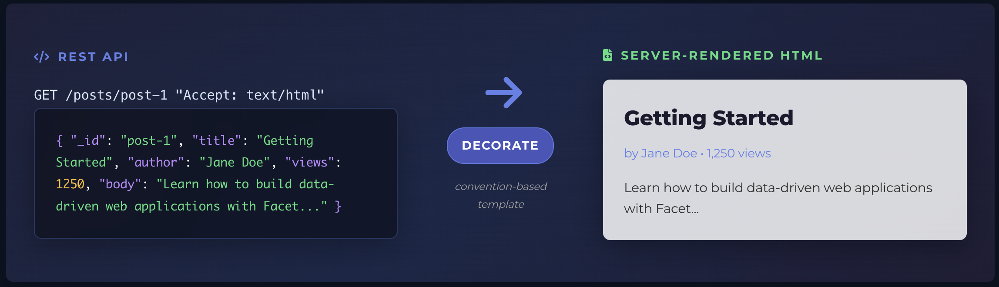

#  Facet

Turn your API into HTML. No code required.


[](https://github.com/SoftInstigate/facet/actions/workflows/build.yml)
[](https://github.com/SoftInstigate/facet/releases)
[](https://jitpack.io/#SoftInstigate/facet)




## What is Facet?

Facet transforms REST APIs into web interfaces using simple HTML templates. You already have the API—just add templates where you want HTML.

**The core idea:** Your API structure is your site structure.
```
Your API:
├── /shop/products     → Returns JSON
└── /shop/products/123 → Returns JSON

Add templates:
└── templates/
    └── shop/
        └── products/
            ├── list.html   → Renders /shop/products as HTML
            └── view.html   → Renders /shop/products/123 as HTML

Result:
├── /shop/products     → HTML for browsers, JSON for APIs
└── /shop/products/123 → HTML for browsers, JSON for APIs
```

No routing files. No controllers. No duplicate logic. Just drop templates where your data lives.

## See It in Action

Try the working example:
```bash
git clone https://github.com/SoftInstigate/facet.git
cd facet

# Option A: use the published image
cd examples/product-catalog
docker compose up

# Option B: build locally (for plugin changes)
# mvn package -DskipTests
# docker compose up --build
```

Note: example docker-compose files build a local image by default. To use the published image, replace the `build:` section with `image: softinstigate/facet:latest`.

**Open:** http://localhost:8080/shop/products

You'll see a complete product catalog with search, pagination, and authentication—all built with templates.

**[→ Follow the Tutorial](docs/TUTORIAL_PRODUCT_CATALOG.md)** to understand how it works by exploring the code.

## How It Works

### 1. You have data in MongoDB
```json
{
  "name": "Laptop Pro",
  "price": 1299,
  "category": "Electronics"
}
```

### 2. Facet exposes it as REST API
```bash
curl http://localhost:8080/shop/products
# Returns JSON array of products
```

### 3. Add a template
```html



<h1>Products</h1>


<article>
  <h3>{{ product.data.name }}</h3>
  <p>Category: {{ product.data.category }}</p>
  <span>${{ product.data.price }}</span>
</article>


```

### 4. Done

Open http://localhost:8080/shop/products in your browser—you get HTML. Call it from your app with `Accept: application/json`—you get JSON.

## What You Get

### Convention Over Configuration

Templates automatically match API paths:
```
GET /shop/products      →  templates/shop/products/list.html
GET /shop/products/123  →  templates/shop/products/view.html
GET /shop/categories    →  templates/shop/categories/list.html
```

No routing configuration needed.

### Everything You Need in Templates

Pagination, filters, sorting—all available automatically:
```html
<!-- Pagination works out of the box -->
<nav>
  Page {{ page }} of {{ totalPages }}
  
    <a href="?page={{ page + 1 }}">Next</a>
  
</nav>

<!-- MongoDB queries accessible -->

  <p>Showing filtered results</p>


<!-- Authentication built in -->

  <button>Delete</button>

```

### HTMX for Smooth Interactions

Partial page updates work automatically—no backend code needed:
```html
<!-- Click updates just the product list -->
<a href="?sort=price" 
   hx-get="?sort=price" 
   hx-target="#product-list">
  Sort by Price
</a>

<div id="product-list">
  <!-- Products here -->
</div>
```

Facet detects HTMX requests and renders only what changed.

### Live Development

Edit templates, refresh browser, see changes. No restart required.

## When to Use Facet

**Good for:**
- Admin dashboards over MongoDB data
- Content-driven websites
- Internal tools and CRUD interfaces
- Adding web UI to existing REST APIs
- Projects where you want HTML without complex frameworks

**Not for:**
- Heavy client-side state management (use React/Vue)
- Non-MongoDB databases (Facet requires a MongoDB-compatible database)
- Projects without REST API layer

## Quick Comparison

### vs Traditional Frameworks (Spring MVC, Django, Rails)

**Facet:** Drop templates in folder matching API path → Done  
**Traditional:** Write routes + controllers + views + models

### vs JavaScript Frameworks (Next.js, Remix)

**Facet:** Server-renders from REST API, simpler stack  
**Next.js:** Full-stack React, complex build process, more moving parts

### vs Hypermedia Frameworks (HTMX + Flask/Express)

**Facet:** Built-in HTMX support, convention-based routing  
**HTMX + Framework:** More manual setup, explicit route definitions

## Technical Details

Built on proven technologies:
- **[RESTHeart](https://restheart.org)** - Production-grade MongoDB REST API server
- **[Pebble](https://pebbletemplates.io)** - Fast template engine (similar to Jinja2/Twig)
- **[GraalVM](https://www.graalvm.org)** - High-performance runtime with optional native compilation

**Runtime options:**
- Standard JVM: ~1s startup, full plugin support
- Native image: <100ms startup, minimal memory (~50MB)

**Deployment:** Single JAR or native binary, runs anywhere—Docker, Kubernetes, bare metal.

### Database Compatibility

| Database | Support Level | Notes |
|----------|---------------|-------|
| ✅ **MongoDB** | Full | All versions 3.6+ |
| ✅ **MongoDB Atlas** | Full | Cloud-native support |
| ✅ **Percona Server** | Full | Drop-in MongoDB replacement |
| ⚙️ **FerretDB** | Good | PostgreSQL-backed MongoDB alternative |
| ⚙️ **AWS DocumentDB** | Good | Most features work, some MongoDB 4.0+ features missing |
| ⚙️ **Azure Cosmos DB** | Good | With MongoDB API compatibility layer |

_Compatibility depends on MongoDB wire protocol implementation._

## Get Started

**Learn by example:**
1. **[Product Catalog Tutorial](docs/TUTORIAL_PRODUCT_CATALOG.md)** - Walk through working code
2. **[Developer's Guide](docs/DEVELOPERS_GUIDE.md)** - Complete reference
3. **[Template Variables](docs/TEMPLATE_CONTEXT_REFERENCE.md)** - What's available in templates

**Try it yourself (quickstart):**
```bash
# Start the quickstart stack (MongoDB + Facet)
docker compose up

# If you want to build a local image instead:
# mvn -pl core -am -DskipTests package
# docker compose up --build

# Visit in browser (login required)
open http://localhost:8080/
```

Note: the root docker-compose.yml builds a local image by default. To use the published image, replace the `build:` section with `image: softinstigate/facet:latest`.

Login with **admin / secret**, then visit **/mydb/products** to see the seeded data rendered by the default template.

Add a product via curl and refresh the HTML list:
```bash
curl -X POST http://localhost:8080/mydb/products \
  -u admin:secret \
  -H "Content-Type: application/json" \
  -d '{"name":"Desk Lamp","price":49,"category":"Home"}'

open http://localhost:8080/mydb/products
```

**Run the quickstart image directly (standalone):**
```bash
docker run --rm -p 8080:8080 \
  -v "$PWD/etc/restheart.yml:/opt/restheart/etc/restheart.yml:ro" \
  -v "$PWD/etc/users.yml:/opt/restheart/etc/users.yml:ro" \
  -v "$PWD/templates:/opt/restheart/templates:ro" \
  -v "$PWD/static:/opt/restheart/static:ro" \
  softinstigate/facet:latest -o /opt/restheart/etc/restheart.yml
```

### Install via Maven / Gradle (JitPack)

Facet publishes **release tags only** to JitPack. Use the raw tag name (no `v` prefix) as the version.

**Maven:**
```xml
<repositories>
  <repository>
    <id>jitpack</id>
    <url>https://jitpack.io</url>
  </repository>
</repositories>

<dependency>
  <groupId>com.github.SoftInstigate</groupId>
  <artifactId>facet-core</artifactId>
  <version>RELEASE_VERSION</version>
</dependency>
```

**Gradle (Kotlin DSL):**
```kotlin
repositories {
  maven("https://jitpack.io")
}

dependencies {
  implementation("com.github.SoftInstigate:facet-core:RELEASE_VERSION")
}
```

**Release binaries:** Download `facet-core.jar` and dependencies from [GitHub Releases](https://github.com/SoftInstigate/facet/releases).

**Docker Hub:** A prebuilt image is available at `softinstigate/facet` (tags match release versions).

## Contributing

Contributions welcome! See [open issues](https://github.com/SoftInstigate/facet/issues) or start a [discussion](https://github.com/SoftInstigate/facet/discussions).

## License

Apache License 2.0 - Free for commercial use.

---

**Made by [SoftInstigate](https://softinstigate.com)** - Creators of [RESTHeart](https://restheart.org)
