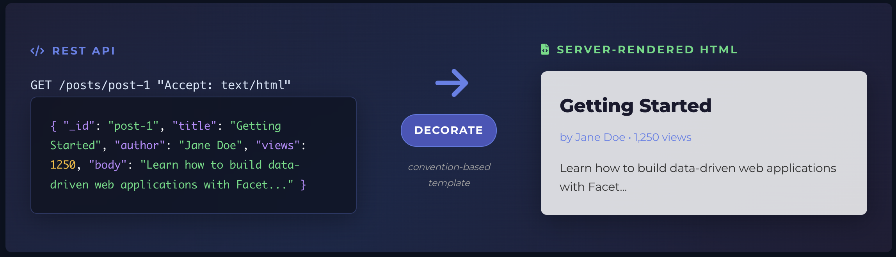
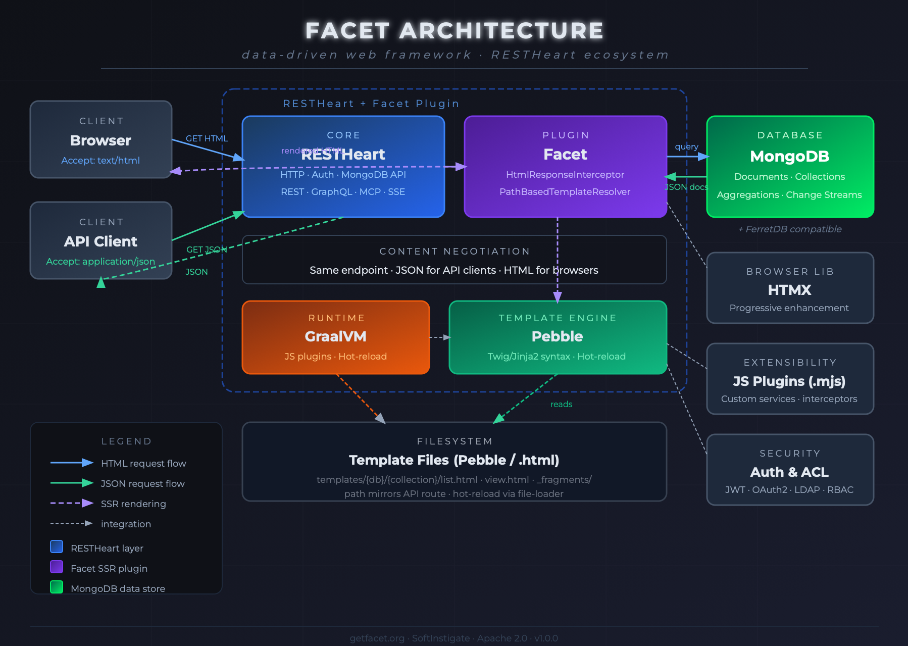

#  Facet

## Turn your MongoDB data into HTML


[](https://github.com/SoftInstigate/facet/actions/workflows/build.yml)
[](https://github.com/SoftInstigate/facet/releases)
[](https://jitpack.io/#SoftInstigate/facet)




Building a UI over a REST API usually means a separate frontend project, route/controller boilerplate, and duplicated logic. Facet avoids that: map templates to API paths and render HTML directly from your existing RESTHeart + MongoDB stack. RESTHeart stays under the hood, so you can start productively without advanced RESTHeart knowledge or Java.

- **No Controllers or Routes:** Ship pages by adding templates, not backend plumbing.

- **API Stays Intact:** SSR is opt-in per resource. No template means the endpoint keeps returning JSON unchanged.

- **One Endpoint, Two Representations:** The same URL serves JSON to API clients and HTML to browsers via content negotiation.

- **RESTHeart Under the Hood:** Facet builds on RESTHeart, but you can get started with templates without learning RESTHeart internals first.

- **No Java Required to Start:** Run the Docker image, write templates, and optionally add JavaScript for interactivity. Java is only needed for local plugin development/custom builds.

- **Polyglot Extensibility:** Add custom services in GraalVM-supported languages (for example JavaScript) when you need backend logic beyond templates.

- **Convention-Based:** Template path matches API path. No routing files or extra configuration.

- **Progressive Enhancement with HTMX:** Start with SSR, add interactivity where needed, keep pages fast and SEO-friendly.

## What is Facet?

Facet renders your MongoDB data exposed by [RESTHeart](https://restheart.org) APIs into server-rendered HTML through path-based templates. Place a template where the URL expects it: that endpoint immediately serves HTML to browsers and JSON to API clients. No controllers. No routing config. No JavaScript build pipeline.

Building a web UI on top of a REST API usually means choosing between a JavaScript frontend project or a Java template engine that requires controllers. Facet is a third option.

**The core idea:** Your API structure is your site structure.
```
Your API:
├── /shop/products     → Returns JSON
└── /shop/products/123 → Returns JSON

Add templates:
└── templates/
    └── shop/
        └── products/
            ├── list.html   → Renders /shop/products as HTML
            └── view.html   → Renders /shop/products/123 as HTML

Result:
├── /shop/products     → HTML for browsers, JSON for APIs
└── /shop/products/123 → HTML for browsers, JSON for APIs
```

No routing files, no controllers and no duplicate logic. Just drop templates where your data lives.

## Architecture

Facet runs as a RESTHeart response interceptor: it decides at response time whether to return JSON unchanged or render HTML from templates.



## See It in Action

Try the working example (no Java required if you use the published image):
```bash
git clone https://github.com/SoftInstigate/facet.git
cd facet

# Option A: use the published image
cd examples/product-catalog
docker compose up

# Option B: build locally (for plugin changes)
# mvn package -DskipTests
# docker compose up --build
```

Note: example docker-compose files build a local image by default. To use the published image, replace the `build:` section with `image: softinstigate/facet:latest`.

**Open:** http://localhost:8080/shop/products

You'll see a complete product catalog with search, pagination, and authentication—all built with templates.

You can start with Facet template conventions first and learn deeper RESTHeart features only when you need them.

**[→ Follow the Tutorial](https://getfacet.org/docs/tutorial/)** to understand how it works by exploring the code.

## How It Works

### 1. You have data in MongoDB
```json
{
  "name": "Laptop Pro",
  "price": 1299,
  "category": "Electronics"
}
```

### 2. RESTHeart exposes it as a REST API
```bash
curl http://localhost:8080/shop/products
# Returns JSON array of products
```

RESTHeart handles authentication, authorization, filtering, sorting, and pagination automatically. Facet intercepts the response before it reaches the client.

### 3. Add a template
```html



<h1>Products</h1>


<article>
  <h3>{{ product.data.name }}</h3>
  <p>Category: {{ product.data.category }}</p>
  <span>${{ product.data.price }}</span>
</article>


```

### 4. Done

Open http://localhost:8080/shop/products in your browser—you get HTML. Call it from your app with `Accept: application/json`—you get JSON.

## What You Get

### Convention Over Configuration

Templates automatically match API paths:
```
GET /shop/products      →  templates/shop/products/list.html
GET /shop/products/123  →  templates/shop/products/view.html
GET /shop/categories    →  templates/shop/categories/list.html
```

No routing configuration needed.

### Everything You Need in Templates

Pagination, filters, sorting—all available automatically:
```html
<!-- Pagination works out of the box -->
<nav>
  Page {{ page }} of {{ totalPages }}
  
    <a href="?page={{ page + 1 }}">Next</a>
  
</nav>

<!-- MongoDB queries accessible -->

  <p>Showing filtered results</p>


<!-- Authentication built in -->

  <button>Delete</button>

```

### HTMX for Smooth Interactions

Partial page updates work automatically—no backend code needed:
```html
<!-- Click updates just the product list -->
<a href="?sort=price" 
   hx-get="?sort=price" 
   hx-target="#product-list">
  Sort by Price
</a>

<div id="product-list">
  <!-- Products here -->
</div>
```

Facet detects HTMX requests and renders only what changed.

### Live Development

Edit templates, refresh browser, see changes. No restart required.

## When to Use Facet

**Good for:**
- Admin dashboards over MongoDB data
- Content-driven websites
- Internal tools and CRUD interfaces
- Adding web UI to existing REST APIs
- Projects where you want HTML without complex frameworks

**Not for:**
- Heavy client-side state management (use React/Vue)
- Non-MongoDB databases (Facet requires a MongoDB-compatible database)
- Backends not running RESTHeart — Facet is a RESTHeart-specific plugin

## Quick Comparison

### vs Traditional Frameworks (Spring MVC, Django, Rails)

**Facet:** Drop templates in folder matching API path → Done  
**Traditional:** Write routes + controllers + views + models

### vs JavaScript Frameworks (Next.js, Remix)

**Facet:** Server-renders from REST API, simpler stack  
**Next.js:** Full-stack React, complex build process, more moving parts

### vs Hypermedia Frameworks (HTMX + Flask/Express)

**Facet:** Built-in HTMX support, convention-based routing  
**HTMX + Framework:** More manual setup, explicit route definitions

## Technical Details

Built on proven technologies:
- **[RESTHeart](https://restheart.org)** - The agent-ready backend for MongoDB. Provides REST, GraphQL, WebSocket, and MCP APIs with built-in auth and zero boilerplate. Facet ships as a RESTHeart plugin and is also available as a [premium plugin on RESTHeart Cloud](https://cloud.restheart.com).
- **[Pebble](https://pebbletemplates.io)** - Fast template engine (similar to Jinja2/Twig)
- **[GraalVM](https://www.graalvm.org)** - High-performance runtime with optional native compilation

Facet leverages GraalVM in two ways: standard JVM execution for maximum compatibility during development, and optional Native Image builds for production profiles that benefit from faster cold starts and lower memory usage.

GraalVM also enables polyglot programming: you can build custom services and extensions with GraalVM-supported languages (for example JavaScript), so teams can add backend behavior without being limited to Java only.

**Runtime options:**
- Standard JVM: ~1s startup, full plugin support
- Native image: <100ms startup, minimal memory (~50MB)

**Deployment:** Single JAR or native binary, runs anywhere—Docker, Kubernetes, bare metal.

### Database Compatibility

| Database | Support Level | Notes |
|----------|---------------|-------|
| ✅ **MongoDB** | Full | All versions 3.6+ |
| ✅ **MongoDB Atlas** | Full | Cloud-native support |
| ✅ **Percona Server** | Full | Drop-in MongoDB replacement |
| ⚙️ **FerretDB** | Good | PostgreSQL-backed MongoDB alternative |
| ⚙️ **AWS DocumentDB** | Good | Most features work, some MongoDB 4.0+ features missing |
| ⚙️ **Azure Cosmos DB** | Good | With MongoDB API compatibility layer |

_Compatibility depends on MongoDB wire protocol implementation._

## Get Started

**Learn by example:**
1. **[Product Catalog Tutorial](https://getfacet.org/docs/tutorial/)** - Walk through working code
2. **[Developer's Guide](https://getfacet.org/docs/developers-guide/)** - Complete reference
3. **[Template Variables](https://getfacet.org/docs/template-context/)** - What's available in templates

**Try it yourself (quickstart):**
```bash
# Start the quickstart stack (MongoDB + Facet)
docker compose up

# If you want to build a local image instead:
# mvn -pl core -am -DskipTests package
# docker compose up --build

# Visit in browser (login required)
open http://localhost:8080/
```

You only need Java/Maven if you want to build Facet locally or work on the plugin itself.

Note: the root docker-compose.yml builds a local image by default. To use the published image, replace the `build:` section with `image: softinstigate/facet:latest`.

Login with **admin / secret**, then visit **/mydb/products** to see the seeded data rendered by the default template.

Add a product via curl and refresh the HTML list:
```bash
curl -X POST http://localhost:8080/mydb/products \
  -u admin:secret \
  -H "Content-Type: application/json" \
  -d '{"name":"Desk Lamp","price":49,"category":"Home"}'

open http://localhost:8080/mydb/products
```

**Run the quickstart image directly (standalone):**
```bash
docker run --rm -p 8080:8080 \
  -v "$PWD/etc/restheart.yml:/opt/restheart/etc/restheart.yml:ro" \
  -v "$PWD/etc/users.yml:/opt/restheart/etc/users.yml:ro" \
  -v "$PWD/templates:/opt/restheart/templates:ro" \
  -v "$PWD/static:/opt/restheart/static:ro" \
  softinstigate/facet:latest -o /opt/restheart/etc/restheart.yml
```

### Install via Maven / Gradle (JitPack)

Facet publishes **release tags only** to JitPack. Use the raw tag name (no `v` prefix) as the version.

**Maven:**
```xml
<repositories>
  <repository>
    <id>jitpack</id>
    <url>https://jitpack.io</url>
  </repository>
</repositories>

<dependency>
  <groupId>com.github.SoftInstigate</groupId>
  <artifactId>facet-core</artifactId>
  <version>1.0.0</version>
</dependency>
```

**Gradle (Kotlin DSL):**
```kotlin
repositories {
  maven("https://jitpack.io")
}

dependencies {
  implementation("com.github.SoftInstigate:facet-core:1.0.0")
}
```

**Release binaries:** Download `facet-core.jar` and dependencies from [GitHub Releases](https://github.com/SoftInstigate/facet/releases).

**Docker Hub:** A prebuilt image is available at [softinstigate/facet](https://hub.docker.com/r/softinstigate/facet) (tags match release versions).

## Contributing

Contributions welcome! See [open issues](https://github.com/SoftInstigate/facet/issues) or start a [discussion](https://github.com/SoftInstigate/facet/discussions).

## License

Apache License 2.0 - Free for commercial use.

---

_Built with ❤️ by [SoftInstigate](https://www.softinstigate.com)_

---

<div align="center">

</div>
