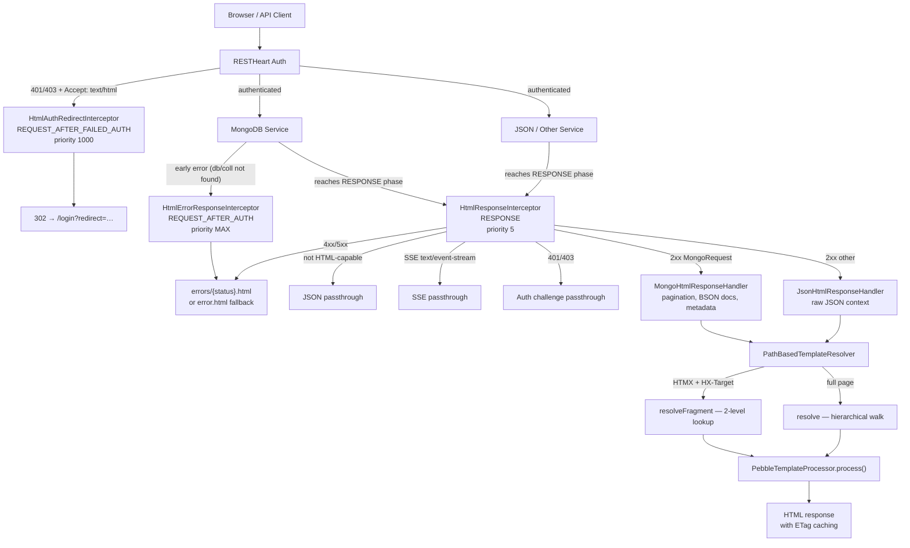

# Facet Architecture

Facet is a [RESTHeart](https://restheart.org) plugin that intercepts HTTP responses and optionally renders them as HTML using path-based Pebble templates. It uses the **interceptor pattern** at the `RESPONSE` phase, with a strategy-based handler chain for different response types.

## Request Flow



*Request flow from browser through RESTHeart interceptors to HTML rendering.*

## Plugin Registration

Facet registers four RESTHeart plugins via `@RegisterPlugin` annotations:

| Plugin | Class | Intercept Point | Priority | enabledByDefault | Purpose |
|--------|-------|-----------------|----------|------------------|---------|
| `html-response-interceptor` | `HtmlResponseInterceptor` | `RESPONSE` | 5 | `false` | Main SSR: transforms 2xx and 4xx/5xx to HTML |
| `html-error-response-interceptor` | `HtmlErrorResponseInterceptor` | `REQUEST_AFTER_AUTH` | `MAX` | **`true`** | Catches early errors before RESPONSE phase |
| `html-auth-redirect-interceptor` | `HtmlAuthRedirectInterceptor` | `REQUEST_AFTER_FAILED_AUTH` | 1000 | `false` | Redirects unauthenticated browsers to `/login` |
| `login-service` | `LoginService` | N/A (JsonService) | N/A | `false` | Serves login form; dynamically registers auth redirect interceptor |

Only `HtmlErrorResponseInterceptor` is enabled by default. Enable the others in RESTHeart config:

```yaml
/html-response-interceptor:
  enabled: true
  response-caching: false   # disable ETag caching for dev
  max-age: 5                # Cache-Control max-age (seconds)

/html-auth-redirect-interceptor:
  enabled: true
  login-uri: /login
  exclude-paths: [/api, /tokens]  # optional: paths that bypass redirect

/login-service:
  enabled: true
  uri: /login
```

See [operations.md](operations.md) for full configuration reference.

## Dependency Injection

Facet uses RESTHeart's `@Inject` annotation for component wiring:

- **`@Inject("pebble-template-processor")`** — `TemplateProcessor` instance (registered by Pebble plugin)
- **`@Inject("mclient")`** — `MongoClient` for count queries and document metadata
- **`@Inject("config")`** — Plugin configuration map from `restheart.yml`

The `@OnInit` method in `HtmlResponseInterceptor` creates the `PathBasedTemplateResolver` and registers response handlers:

```java
// Handlers are tried in order; first match wins
this.handlers.add(new MongoHtmlResponseHandler(mongoClient, templateProcessor));
this.handlers.add(new JsonHtmlResponseHandler(templateProcessor)); // fallback
```

## Response Handler Strategy

`HtmlResponseInterceptor` delegates context building to specialized handlers implementing `HtmlResponseHandler`:

### MongoHtmlResponseHandler

Handles `MongoRequest` instances (RESTHeart's MongoDB service). Builds rich template context including:

- BsonDocument list transformation to JSON
- Pagination: `page`, `pagesize`, `totalPages`, `totalItems`
- MongoDB metadata: `database`, `collection`, `resourceType`
- Mount context: mount-resolved `db`, `coll`, permission flags (`canCreateDatabases`, `canCreateCollections`, etc.)
- Query parameters: `filter`, `sort`, `keys`
- Document `_id` metadata for URL generation via `IdTypeDetector`
- Tenant context: `tenantId`, `isMultiTenant`, `hostParams` for parametric mount support

Includes a **TTL count cache** (`ConcurrentHashMap<String, CacheEntry>`, 5-second TTL) to avoid extra MongoDB round-trips for `estimatedDocumentCount()`, `countDocuments()`, `countDatabases()`, and `countCollections()` per rendered page.

Source: [`core/src/main/java/org/facet/html/handlers/MongoHtmlResponseHandler.java`](../core/src/main/java/org/facet/html/handlers/MongoHtmlResponseHandler.java)

### JsonHtmlResponseHandler

Generic fallback for non-MongoDB service responses. Wraps the raw JSON response body in a minimal template context. Always returns `canHandle = true`, so it must be registered last.

Source: [`core/src/main/java/org/facet/html/handlers/JsonHtmlResponseHandler.java`](../core/src/main/java/org/facet/html/handlers/JsonHtmlResponseHandler.java)

### LoginService

`LoginService` is a `JsonService` (not an interceptor) that returns a JSON model for `GET /login`. The `HtmlResponseInterceptor` then renders the model into the `templates/login/index.html` template.

On initialization, `LoginService` dynamically registers `HtmlAuthRedirectInterceptor` via the plugin registry if no instance is already present. This ensures that unauthenticated browser requests are redirected to the login page even when the interceptor was not explicitly configured.

Source: [`core/src/main/java/org/facet/html/LoginService.java`](../core/src/main/java/org/facet/html/LoginService.java)

## Template Resolution

Template lookup is handled by [`PathBasedTemplateResolver`](template-system.md), which is a stateless utility. The resolver is passed the `TemplateProcessor` at call time rather than being injected — this decouples the `html` package from the `templates` package.

See [template-system.md](template-system.md) for the full resolution algorithm.

## HTMX Awareness

The interceptor detects HTMX requests via `HtmxRequestDetector.isHtmxRequest()`, which checks for `HX-Request: true` header combined with `Accept: */*`. It adjusts rendering accordingly:

- **HTMX + `HX-Target`** → fragment template (strict 2-level lookup via `_fragments/` subdirectories)
- **HTMX without `HX-Target`** → full page template (same as standard browser request)
- **SSE `text/event-stream`** → always bypasses interception

See [htmx.md](htmx.md) for fragment resolution details.

## Error Handling

Two interceptors cooperate for error rendering, covering different lifecycle phases:

1. **`HtmlErrorResponseInterceptor`** (`REQUEST_AFTER_AUTH`, `Integer.MAX_VALUE` priority) — catches errors that occur *before* the RESPONSE phase. Some services (notably MongoDB) detect errors like database/collection-not-found during `REQUEST_AFTER_AUTH` and terminate the exchange early. This interceptor catches those early errors for HTML-capable browser requests and delegates to `HtmlResponseHelper.renderErrorPage()`.

2. **`HtmlResponseInterceptor`** (`RESPONSE`, priority 5) — catches errors that reach the RESPONSE phase, such as document-not-found (404) or paths with invalid extra segments (treated as 404). Also delegates to `HtmlResponseHelper.renderErrorPage()`.

Both interceptors call `HtmlResponseHelper.renderErrorPage()`, which resolves per-status-code templates (`errors/{statusCode}.html`) with fallback to `error.html`, and falls back to inline HTML if template processing fails entirely.

Source: [`core/src/main/java/org/facet/html/internal/HtmlResponseHelper.java`](../core/src/main/java/org/facet/html/internal/HtmlResponseHelper.java)

## SSE Bypass

Server-Sent Events requests (`Accept: text/event-stream`) are explicitly excluded from HTML interception to avoid breaking RESTHeart's SSE infrastructure. This was added in commit `8d251a2` to fix issue #8.

Source: [`HtmlResponseInterceptor.java` — `isEventStreamRequest()` check](../core/src/main/java/org/facet/html/HtmlResponseInterceptor.java)

## Key Source Files

| File | Role |
|------|------|
| `core/src/main/java/org/facet/html/HtmlResponseInterceptor.java` | Main interceptor: SSE bypass, handler strategy, HTMX fragment resolution, ETag caching |
| `core/src/main/java/org/facet/html/HtmlErrorResponseInterceptor.java` | Early error rendering (REQUEST_AFTER_AUTH phase) |
| `core/src/main/java/org/facet/html/HtmlAuthRedirectInterceptor.java` | Auth redirect to /login with exclude-paths support |
| `core/src/main/java/org/facet/html/LoginService.java` | Login form service; dynamically registers auth redirect interceptor |
| `core/src/main/java/org/facet/html/handlers/HtmlResponseHandler.java` | Strategy interface: `canHandle()` + `buildContext()` |
| `core/src/main/java/org/facet/html/handlers/MongoHtmlResponseHandler.java` | MongoDB context builder: pagination, BSON docs, mount context, tenant, count cache |
| `core/src/main/java/org/facet/html/handlers/JsonHtmlResponseHandler.java` | JSON fallback handler (accepts any response) |
| `core/src/main/java/org/facet/html/internal/HtmlResponseHelper.java` | `acceptsHtml()`, `isEventStreamRequest()`, `renderErrorPage()`, ETag caching |
| `core/src/main/java/org/facet/html/internal/HtmxRequestDetector.java` | HTMX header parsing (`HX-Request`, `HX-Target`, etc.) |
| `core/src/main/java/org/facet/html/internal/HtmxResponseHelper.java` | Server-side HTMX response headers (`HX-Trigger`, `HX-Retarget`, etc.) |
| `core/src/main/java/org/facet/html/internal/IdTypeDetector.java` | MongoDB `_id` type detection for RESTHeart `id_type` query parameter |
| `core/src/main/java/org/facet/templates/PathBasedTemplateResolver.java` | Template resolution with hierarchical fallback and HTMX fragment support |
| `core/src/main/java/org/facet/templates/TemplateProcessor.java` | Template engine interface |
| `core/src/main/java/org/facet/templates/TemplateContextBuilder.java` | Fluent context variable builder |
| `core/src/main/java/org/facet/templates/TemplateResolver.java` | Resolver interface contract (`resolve`, `resolveFragment`) |
| `core/src/main/java/org/facet/templates/pebble/PebbleTemplateProcessor.java` | Pebble template engine implementation |
