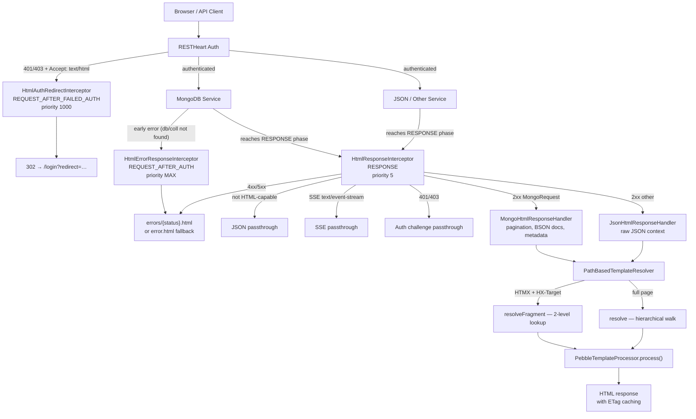

# Facet Architecture

Facet is a [RESTHeart](https://restheart.org) plugin that intercepts HTTP responses and optionally renders them as HTML using path-based Pebble templates. It uses the **interceptor pattern** at the `RESPONSE` phase, with a strategy-based handler chain for different response types.

## Request Flow



*Request flow from browser through RESTHeart interceptors to HTML rendering.*

## Plugin Registration

Facet registers four RESTHeart plugins via `@RegisterPlugin` annotations:

| Plugin | Class | Intercept Point | Purpose |
|--------|-------|-----------------|---------|
| `html-response-interceptor` | `HtmlResponseInterceptor` | `RESPONSE` (priority 5) | Main SSR: transforms 2xx and 4xx/5xx to HTML |
| `html-error-response-interceptor` | `HtmlErrorResponseInterceptor` | `REQUEST_AFTER_AUTH` (priority MAX) | Catches early errors before RESPONSE phase |
| `html-auth-redirect-interceptor` | `HtmlAuthRedirectInterceptor` | `REQUEST_AFTER_FAILED_AUTH` (priority 1000) | Redirects unauthenticated browsers to `/login` |
| `login-service` | `LoginService` | N/A (JsonService) | Serves login form; interceptor renders the template |

All are `enabledByDefault = false` except `HtmlErrorResponseInterceptor`. Enable them in RESTHeart config:

```yaml
/html-response-interceptor:
  enabled: true
  response-caching: false   # disable ETag caching for dev
  max-age: 5                # Cache-Control max-age (seconds)

/html-auth-redirect-interceptor:
  enabled: true
  login-uri: /login

/login-service:
  enabled: true
  uri: /login
```

## Dependency Injection

Facet uses RESTHeart's `@Inject` annotation for component wiring:

- **`@Inject("pebble-template-processor")`** — `TemplateProcessor` instance (registered by Pebble plugin)
- **`@Inject("mclient")`** — `MongoClient` for count queries and document metadata
- **`@Inject("config")`** — Plugin configuration map from `restheart.yml`

The `@OnInit` method in `HtmlResponseInterceptor` creates the `PathBasedTemplateResolver` and registers response handlers:

```java
// Handlers are tried in order; first match wins
this.handlers.add(new MongoHtmlResponseHandler(mongoClient, templateProcessor));
this.handlers.add(new JsonHtmlResponseHandler(templateProcessor)); // fallback
```

## Response Handler Strategy

`HtmlResponseInterceptor` delegates context building to specialized handlers implementing `HtmlResponseHandler`:

### MongoHtmlResponseHandler

Handles `MongoRequest` instances (RESTHeart's MongoDB service). Builds rich template context including:

- BsonDocument list transformation to JSON
- Pagination: `page`, `pagesize`, `totalPages`, `totalItems`
- MongoDB metadata: `database`, `collection`, `resourceType`
- Mount context: `mountedDatabase`, `mountedCollection`, permission flags
- Query parameters: `filter`, `sort`, `keys`
- Document `_id` metadata for URL generation

Includes a **TTL count cache** (`ConcurrentHashMap<String, CacheEntry>`, 5-second TTL) to avoid extra MongoDB round-trips for `estimatedDocumentCount()` and `countDocuments()` per rendered page.

Source: [`core/src/main/java/org/facet/html/handlers/MongoHtmlResponseHandler.java`](../core/src/main/java/org/facet/html/handlers/MongoHtmlResponseHandler.java)

### JsonHtmlResponseHandler

Generic fallback for non-MongoDB service responses. Wraps the raw JSON response body in a minimal template context.

Source: [`core/src/main/java/org/facet/html/handlers/JsonHtmlResponseHandler.java`](../core/src/main/java/org/facet/html/handlers/JsonHtmlResponseHandler.java)

## Template Resolution

Template lookup is handled by [`PathBasedTemplateResolver`](template-system.md), which is a stateless utility. The resolver is passed the `TemplateProcessor` at call time rather than being injected — this decouples the `html` package from the `templates` package.

See [template-system.md](template-system.md) for the full resolution algorithm.

## HTMX Awareness

The interceptor detects HTMX requests via `HtmxRequestDetector` and adjusts rendering:

- **HTMX + `HX-Target`** → fragment template (strict 2-level lookup)
- **HTMX without `HX-Target`** → full page template (same as standard)
- **SSE `text/event-stream`** → always bypasses interception

See [htmx.md](htmx.md) for fragment resolution details.

## Error Handling

Two interceptors cooperate for error rendering:

1. **`HtmlErrorResponseInterceptor`** (REQUEST_AFTER_AUTH) — catches errors that occur before the RESPONSE phase, such as MongoDB database/collection not found. Runs at `Integer.MAX_VALUE` priority (last).
2. **`HtmlResponseInterceptor`** (RESPONSE) — catches errors that reach the RESPONSE phase, such as document-not-found (404).

Both delegate to `HtmlResponseHelper.renderErrorPage()`, which resolves per-status-code templates (`errors/{statusCode}.html`) with fallback to `error.html`.

Source: [`core/src/main/java/org/facet/html/internal/HtmlResponseHelper.java`](../core/src/main/java/org/facet/html/internal/HtmlResponseHelper.java)

## SSE Bypass

Server-Sent Events requests (`Accept: text/event-stream`) are explicitly excluded from HTML interception to avoid breaking RESTHeart's SSE infrastructure. This was added in commit `8d251a2` to fix issue #8.

Source: [`HtmlResponseInterceptor.java` — `isEventStreamRequest()` check](../core/src/main/java/org/facet/html/HtmlResponseInterceptor.java)

## Key Source Files

| File | Role |
|------|------|
| `core/src/main/java/org/facet/html/HtmlResponseInterceptor.java` | Main interceptor: resolve + handle |
| `core/src/main/java/org/facet/html/HtmlErrorResponseInterceptor.java` | Early error rendering |
| `core/src/main/java/org/facet/html/HtmlAuthRedirectInterceptor.java` | Auth redirect to /login |
| `core/src/main/java/org/facet/html/LoginService.java` | Login form service |
| `core/src/main/java/org/facet/html/handlers/MongoHtmlResponseHandler.java` | MongoDB context builder (largest file) |
| `core/src/main/java/org/facet/html/handlers/JsonHtmlResponseHandler.java` | JSON fallback handler |
| `core/src/main/java/org/facet/html/internal/HtmlResponseHelper.java` | acceptsHtml, renderErrorPage, caching |
| `core/src/main/java/org/facet/html/internal/HtmxRequestDetector.java` | HTMX header parsing |
| `core/src/main/java/org/facet/html/internal/HtmxResponseHelper.java` | Server-side HTMX response headers |
| `core/src/main/java/org/facet/html/internal/IdTypeDetector.java` | MongoDB _id type detection |
| `core/src/main/java/org/facet/templates/PathBasedTemplateResolver.java` | Template resolution (hierarchical) |
| `core/src/main/java/org/facet/templates/TemplateProcessor.java` | Template engine interface |
| `core/src/main/java/org/facet/templates/TemplateContextBuilder.java` | Context variable builder |
| `core/src/main/java/org/facet/templates/TemplateResolver.java` | Resolver interface contract |
| `core/src/main/java/org/facet/templates/pebble/PebbleTemplateProcessor.java` | Pebble implementation |
