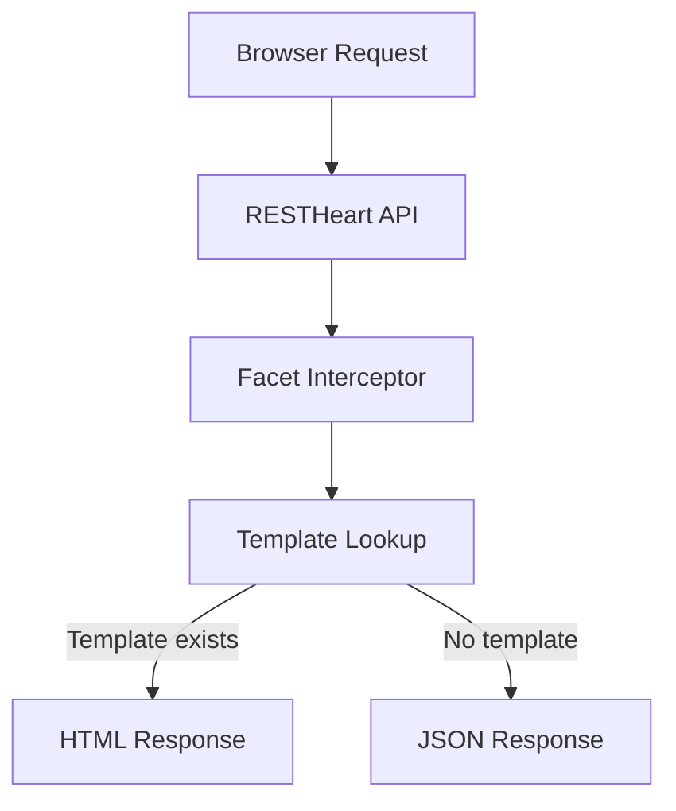

# Facet Quickstart

**Facet** is a data-driven web framework that turns [MongoDB](https://mongodb.com) data into server-rendered HTML. It runs as a [RESTHeart](https://restheart.org) plugin and uses convention-based [Pebble](https://pebbletemplates.io) templates: place a template where the URL expects it, and that endpoint immediately serves HTML to browsers while continuing to return JSON to API clients.

The core idea: **your API structure is your site structure**.



*How a browser request becomes HTML: Facet intercepts RESTHeart responses and checks for matching templates.*

```
API:       /shop/products       → JSON
Template:  templates/shop/products/list.html
Result:    /shop/products       → HTML for browsers, JSON for API clients
```

No controllers, no routing config, no JavaScript build pipeline required.

## Run It in 30 Seconds

Choose your deployment path first:

1. Docker image (recommended)
Use the published Facet image for the fastest self-contained setup.

2. Manual plugin deployment (advanced)
Add Facet artifacts into an existing RESTHeart runtime when you already operate RESTHeart directly.

If you are evaluating Facet or starting from scratch, use Docker.

```bash
git clone https://github.com/SoftInstigate/facet.git && cd facet

# Recommended: use the published image (no Java needed)
docker compose up

# Optional: local build path (for Facet plugin changes)
mvn -pl core -am -DskipTests package
docker compose up --build
```

Open http://localhost:8080/mydb/products — login with **admin / secret**.

The root `docker-compose.yml` starts MongoDB 8.0, seeds sample products via `/etc/init-data.js`, and runs the Facet RESTHeart image with templates from `/templates`.

## How It Works

1. RESTHeart exposes MongoDB collections as REST endpoints.
2. Facet intercepts HTTP responses at the `RESPONSE` phase.
3. If the request accepts HTML (`Accept: text/html` or HTMX headers) **and** a matching template exists, Facet renders HTML via Pebble.
4. If no template matches, the original JSON response passes through unchanged.

This is the [interceptor pattern](architecture.md) — SSR is opt-in per resource.

## Repository at a Glance

```
facet/
├── core/                           # The Facet plugin (JAR)
│   └── src/main/java/org/facet/
│       ├── html/                   # Interceptors & response handlers
│       │   ├── HtmlResponseInterceptor.java      ← main SSR interceptor
│       │   ├── HtmlErrorResponseInterceptor.java  ← early error rendering
│       │   ├── HtmlAuthRedirectInterceptor.java   ← auth redirects
│       │   ├── LoginService.java                  ← cookie-based login
│       │   ├── handlers/                          # Strategy handlers
│       │   └── internal/                          # HTMX helpers, utilities
│       └── templates/              # Template engine & resolution
│           ├── PathBasedTemplateResolver.java     ← hierarchical lookup
│           ├── TemplateContextBuilder.java         ← template variables
│           └── pebble/                            # Pebble implementation
├── templates/                      # Quickstart templates (root-level)
├── static/                         # Static assets (favicon, etc.)
├── etc/                            # RESTHeart config + seed data
├── examples/product-catalog/       # Full CRUD example with HTMX
├── docs/                           # Architecture diagram assets
├── pom.xml                         # Parent POM (Java 25, RESTHeart Commons 9.7.2)
└── Dockerfile                      # RESTHeart base + Facet plugin
```

## What to Read Next

| Topic | Page | Why |
|-------|------|-----|
| **Architecture** | [architecture.md](architecture.md) | Understand the interceptor pipeline, plugin registration, and request flow |
| **Template System** | [template-system.md](template-system.md) | Learn the resolution algorithm, naming conventions, and context variables |
| **HTMX Integration** | [htmx.md](htmx.md) | Fragment resolution, partial updates, and mutation patterns |
| **JavaScript Plugins** | [javascript-plugins.md](javascript-plugins.md) | Write server-side services and interceptors in JavaScript, hot-reload, MongoDB access |
| **Operations** | [operations.md](operations.md) | Build, Docker, RESTHeart config, CI/CD, and release process |
| **Testing** | [testing.md](testing.md) | Unit tests (75) and integration tests (Testcontainers), how to run them, and known gaps |

## Key Technical Facts

- **Java 25** — set via `maven.compiler.release` in the parent POM
- **RESTHeart Commons 9.7.2** — core dependency, scoped as `provided`
- **Pebble 4.1.2** — template engine (Jinja2/Twig-like syntax)
- **Current version** — `1.0.3-SNAPSHOT` (first stable release was 1.0.0 on 2026-03-13)
- **License** — Apache 2.0

## Quick Reference: Template Conventions

```
GET /mydb/products      → templates/mydb/products/list.html   (collection)
GET /mydb/products/123  → templates/mydb/products/view.html   (document)
HTMX #product-list      → templates/mydb/products/_fragments/product-list.html
```

No template? JSON passes through. See [template-system.md](template-system.md) for the full resolution algorithm.

## Backlog

- **`HX-Reselect` response header** — not implemented (minor HTMX gap). Source: CHANGELOG.md Known Limitations.
- **Streaming for JSON handler** — `JsonHtmlResponseHandler` loads full response into memory. Source: CHANGELOG.md.
- **Configurable count cache TTL** — hardcoded at 5 seconds in `MongoHtmlResponseHandler`. Source: `core/src/main/java/org/facet/html/handlers/MongoHtmlResponseHandler.java`.
- **MongoDB timeout handling** — operation timeout not configurable. Source: CHANGELOG.md.
- **Thread pool config for Pebble** — not yet exposed. Source: CHANGELOG.md.
- **Redirect query param name** — `?redirect=` parameter name not configurable. Source: CHANGELOG.md.
